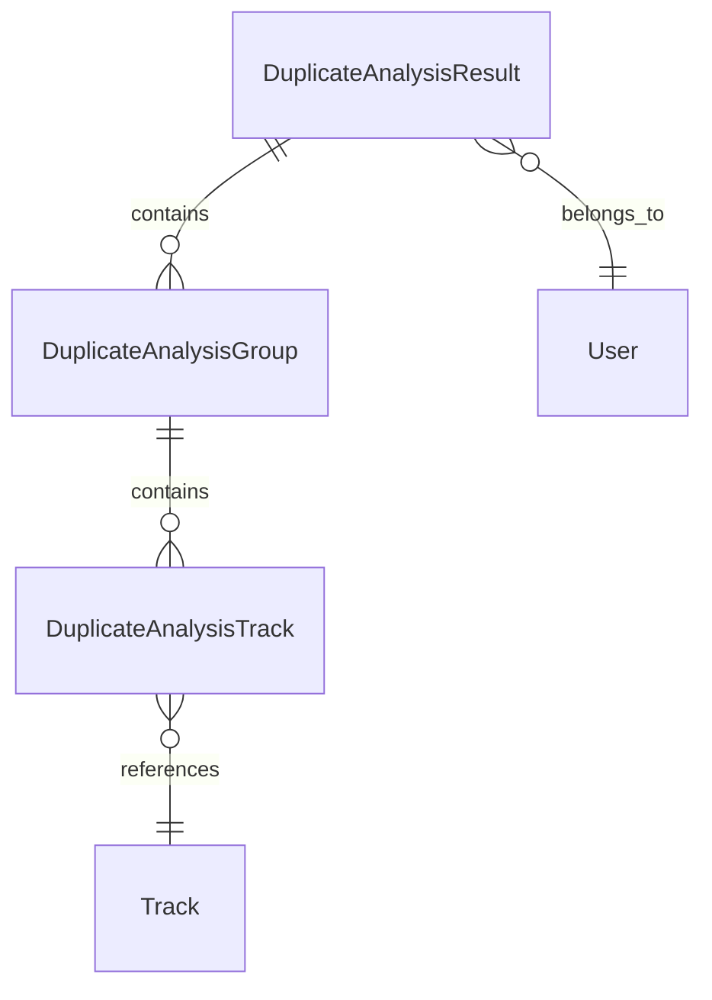

# Design Document

## Overview

The duplicate results persistence feature extends the existing duplicate song management system by adding a persistent storage layer for duplicate detection results. This enhancement addresses the current limitation where users lose their analysis work when navigating away from the duplicate management screen. The system will store duplicate detection results in the database with timestamps, provide progress tracking with real-time updates, and include comprehensive logging for monitoring and troubleshooting.

The design builds upon the existing duplicate detection infrastructure, including the `DuplicateDetectionService`, `DuplicateCacheService`, and admin blueprint, while adding new database models and enhanced user interface components for persistence management.

## Architecture

### Component Structure

The persistence system extends the existing Flask blueprint architecture with new database models and enhanced services:

```
models.py (extended)
├── DuplicateAnalysisResult (new model)
├── DuplicateAnalysisGroup (new model)
└── DuplicateAnalysisTrack (new model)

services/
├── duplicate_detection_service.py (enhanced)
├── duplicate_persistence_service.py (new)
└── duplicate_cache_service.py (enhanced)

blueprints/admin/
├── routes.py (enhanced with persistence endpoints)
└── templates/
    └── duplicate_management.html (enhanced with persistence UI)

static/js/
└── duplicate_persistence.js (new)
```

### Database Schema Design

The persistence system introduces three new database models to store duplicate analysis results:

1. **DuplicateAnalysisResult**: Stores metadata about each analysis session
2. **DuplicateAnalysisGroup**: Stores individual duplicate groups found in each analysis
3. **DuplicateAnalysisTrack**: Stores individual tracks within each duplicate group

This normalized approach allows for efficient querying, proper relationships, and manageable storage cleanup.

### Integration Points

The system integrates with existing components:
- **DuplicateDetectionService**: Enhanced to save results automatically
- **DuplicateCacheService**: Extended to work with persistent storage
- **Admin Blueprint**: New endpoints for persistence management
- **Audit Logging**: Integration with existing audit trail system

## Components and Interfaces

### 1. Database Models

#### DuplicateAnalysisResult Model
```python
class DuplicateAnalysisResult(db.Model):
    __tablename__ = 'duplicate_analysis_results'
    
    id = Column(Integer, primary_key=True, autoincrement=True)
    analysis_id = Column(String(36), unique=True, nullable=False)  # UUID
    user_id = Column(Integer, ForeignKey('Users.id'), nullable=True)
    created_at = Column(DateTime, nullable=False, default=func.now())
    completed_at = Column(DateTime, nullable=True)
    status = Column(String(20), nullable=False, default='running')  # running, completed, failed, cancelled
    
    # Analysis parameters
    search_term = Column(String, nullable=True)
    sort_by = Column(String(50), nullable=False, default='artist')
    min_confidence = Column(db.Float, nullable=False, default=0.0)
    
    # Analysis results summary
    total_tracks_analyzed = Column(Integer, nullable=True)
    total_groups_found = Column(Integer, nullable=True)
    total_duplicates_found = Column(Integer, nullable=True)
    average_similarity_score = Column(db.Float, nullable=True)
    processing_time_seconds = Column(db.Float, nullable=True)
    
    # Library state tracking
    library_track_count = Column(Integer, nullable=True)  # Total tracks when analysis was run
    library_last_modified = Column(DateTime, nullable=True)  # Estimated last library modification
    
    # Error information
    error_message = Column(String, nullable=True)
    error_details = Column(JSON, nullable=True)
    
    # Relationships
    groups = relationship('DuplicateAnalysisGroup', back_populates='analysis', cascade='all, delete-orphan')
    user = relationship('User', foreign_keys=[user_id])
```

#### DuplicateAnalysisGroup Model
```python
class DuplicateAnalysisGroup(db.Model):
    __tablename__ = 'duplicate_analysis_groups'
    
    id = Column(Integer, primary_key=True, autoincrement=True)
    analysis_id = Column(String(36), ForeignKey('duplicate_analysis_results.analysis_id'), nullable=False)
    group_index = Column(Integer, nullable=False)  # Order within the analysis
    
    # Group metadata
    canonical_track_id = Column(Integer, nullable=False)  # ID of suggested canonical track
    duplicate_count = Column(Integer, nullable=False)
    average_similarity_score = Column(db.Float, nullable=False)
    suggested_action = Column(String(50), nullable=False)
    
    # iTunes integration
    has_itunes_matches = Column(db.Boolean, nullable=False, default=False)
    itunes_match_data = Column(JSON, nullable=True)
    
    # Status tracking
    resolved = Column(db.Boolean, nullable=False, default=False)
    resolved_at = Column(DateTime, nullable=True)
    resolution_action = Column(String(50), nullable=True)  # deleted, kept_canonical, manual_review
    
    # Relationships
    analysis = relationship('DuplicateAnalysisResult', back_populates='groups')
    tracks = relationship('DuplicateAnalysisTrack', back_populates='group', cascade='all, delete-orphan')
```

#### DuplicateAnalysisTrack Model
```python
class DuplicateAnalysisTrack(db.Model):
    __tablename__ = 'duplicate_analysis_tracks'
    
    id = Column(Integer, primary_key=True, autoincrement=True)
    group_id = Column(Integer, ForeignKey('duplicate_analysis_groups.id'), nullable=False)
    track_id = Column(Integer, nullable=False)  # Reference to tracks table
    
    # Track snapshot (in case original track is deleted)
    song_name = Column(String, nullable=True)
    artist_name = Column(String, nullable=True)
    album_name = Column(String, nullable=True)
    play_count = Column(Integer, nullable=True)
    last_played = Column(DateTime, nullable=True)
    date_added = Column(DateTime, nullable=True)
    
    # Analysis metadata
    similarity_score = Column(db.Float, nullable=False)
    is_canonical = Column(db.Boolean, nullable=False, default=False)
    
    # iTunes integration
    itunes_match_found = Column(db.Boolean, nullable=False, default=False)
    itunes_match_confidence = Column(db.Float, nullable=True)
    itunes_match_type = Column(String(20), nullable=True)  # exact, fuzzy, none
    
    # Status tracking
    still_exists = Column(db.Boolean, nullable=False, default=True)  # Track still exists in database
    deleted_at = Column(DateTime, nullable=True)
    
    # Relationships
    group = relationship('DuplicateAnalysisGroup', back_populates='tracks')
```

### 2. Duplicate Persistence Service

**Purpose**: Manages saving, loading, and cleanup of duplicate analysis results

```python
class DuplicatePersistenceService:
    def __init__(self):
        self.cleanup_days = 30
        self.max_results_per_user = 5
    
    def save_analysis_result(self, analysis_id: str, user_id: int, 
                           duplicate_groups: List[DuplicateGroup], 
                           analysis_params: Dict, 
                           analysis_stats: DuplicateAnalysis) -> DuplicateAnalysisResult
    
    def load_analysis_result(self, analysis_id: str) -> Optional[DuplicateAnalysisResult]
    
    def get_latest_analysis(self, user_id: int, 
                          search_term: Optional[str] = None) -> Optional[DuplicateAnalysisResult]
    
    def get_user_analyses(self, user_id: int, limit: int = 10) -> List[DuplicateAnalysisResult]
    
    def update_analysis_status(self, analysis_id: str, status: str, 
                             error_message: Optional[str] = None) -> None
    
    def mark_groups_resolved(self, group_ids: List[int], 
                           resolution_action: str) -> None
    
    def cleanup_old_results(self) -> Dict[str, int]
    
    def export_analysis_results(self, analysis_id: str, 
                              format: str = 'json') -> Dict
    
    def get_library_change_summary(self, since_analysis_id: str) -> Dict
    
    def is_analysis_stale(self, analysis_result: DuplicateAnalysisResult, 
                         staleness_hours: int = 24) -> bool
    
    def get_analysis_age_info(self, analysis_result: DuplicateAnalysisResult) -> Dict:
        """Get detailed age information with user-friendly formatting and recommendations."""
    
    def get_refresh_recommendations(self, analysis_result: DuplicateAnalysisResult) -> Dict:
        """Get recommendations for whether user should refresh based on age and library changes."""
```

### 3. Enhanced Duplicate Detection Service

The existing `DuplicateDetectionService` will be enhanced with persistence capabilities:

```python
class DuplicateDetectionService:
    # Existing methods remain unchanged
    
    def find_duplicates_with_persistence(self, search_term: Optional[str] = None, 
                                       sort_by: str = 'artist', 
                                       min_confidence: float = 0.0,
                                       user_id: int = None,
                                       force_refresh: bool = False,
                                       progress_callback: Optional[Callable] = None) -> Dict:
        """
        Find duplicates with automatic persistence and progress tracking.
        
        Returns:
            Dict containing analysis_id, duplicate_groups, and metadata
        """
    
    def get_analysis_progress(self, analysis_id: str) -> Dict:
        """Get current progress of a running analysis."""
    
    def cancel_analysis(self, analysis_id: str) -> bool:
        """Cancel a running analysis."""
    
    def update_progress(self, analysis_id: str, phase: str, 
                       current: int, total: int, message: str) -> None:
        """Update progress information for an analysis."""
```

### 4. Progress Tracking System

**Real-time Progress Updates**:
```python
@dataclass
class AnalysisProgress:
    analysis_id: str
    status: str  # 'starting', 'loading_tracks', 'analyzing_similarities', 'cross_referencing', 'saving_results', 'completed'
    phase: str
    current_step: int
    total_steps: int
    percentage: float
    estimated_remaining_seconds: Optional[int]
    current_message: str
    tracks_processed: int
    total_tracks: int
    groups_found: int
    start_time: datetime
    last_update: datetime
```

**Progress Storage**:
- In-memory storage for active analyses using Redis or Python dict
- WebSocket or Server-Sent Events for real-time UI updates
- Fallback to polling for progress updates

### 5. Enhanced Admin Routes

New endpoints for persistence management:

```python
@admin_bp.route('/duplicates/analyses')
def list_analyses():
    """List saved duplicate analyses for current user with age indicators."""

@admin_bp.route('/duplicates/analysis/<analysis_id>')
def get_analysis(analysis_id):
    """Get specific analysis results with age notification and refresh options."""

@admin_bp.route('/duplicates/analysis/<analysis_id>/age-check')
def check_analysis_age(analysis_id):
    """Check if analysis is stale and provide refresh recommendations."""

@admin_bp.route('/duplicates/analysis/<analysis_id>/library-changes')
def get_library_changes(analysis_id):
    """Get summary of library changes since analysis was performed."""

@admin_bp.route('/duplicates/analysis/<analysis_id>/export')
def export_analysis(analysis_id):
    """Export analysis results to CSV/JSON."""

@admin_bp.route('/duplicates/analysis/<analysis_id>/refresh', methods=['POST'])
def refresh_analysis(analysis_id):
    """Refresh an existing analysis with same parameters."""

@admin_bp.route('/duplicates/quick-refresh', methods=['POST'])
def quick_refresh():
    """Start new analysis with parameters from most recent analysis."""

@admin_bp.route('/duplicates/progress/<analysis_id>')
def get_analysis_progress(analysis_id):
    """Get real-time progress of running analysis."""

@admin_bp.route('/duplicates/analysis/<analysis_id>/cancel', methods=['POST'])
def cancel_analysis(analysis_id):
    """Cancel a running analysis."""

@admin_bp.route('/duplicates/cleanup', methods=['POST'])
def cleanup_old_analyses():
    """Clean up old analysis results."""
```

## Data Models

### Analysis Result Storage

The persistence system uses a normalized database schema to efficiently store duplicate analysis results:

1. **Analysis Metadata**: Stored in `DuplicateAnalysisResult` with analysis parameters, timing, and summary statistics
2. **Duplicate Groups**: Stored in `DuplicateAnalysisGroup` with group-level metadata and iTunes integration data
3. **Individual Tracks**: Stored in `DuplicateAnalysisTrack` with track snapshots and similarity scores

### Data Relationships



### Storage Optimization

- **Compression**: JSON fields compressed for large iTunes match data
- **Indexing**: Strategic indexes on frequently queried fields (user_id, created_at, status)
- **Partitioning**: Consider partitioning by date for large installations
- **Cleanup**: Automated cleanup of old results to prevent unbounded growth

## Error Handling

### Analysis Failure Recovery

1. **Timeout Handling**:
   - Configurable timeout for long-running analyses
   - Graceful cancellation with partial result preservation
   - Resume capability for interrupted analyses

2. **Database Transaction Safety**:
   - Atomic saves for analysis results
   - Rollback on partial failures
   - Retry logic for transient database errors

3. **Memory Management**:
   - Streaming processing for large datasets
   - Progress checkpoints to prevent memory exhaustion
   - Garbage collection of intermediate results

### Error Response Patterns

```python
# Analysis Error Response
{
    "success": false,
    "error": {
        "code": "ANALYSIS_TIMEOUT",
        "message": "Analysis timed out after 300 seconds",
        "analysis_id": "uuid-here",
        "partial_results_available": true,
        "retry_suggested": true
    }
}

# Progress Error Response
{
    "success": false,
    "error": {
        "code": "ANALYSIS_NOT_FOUND",
        "message": "Analysis with ID uuid-here not found or expired",
        "suggestions": ["Start a new analysis", "Check analysis history"]
    }
}
```

### Logging Strategy

**Application Logging**:
```python
# Progress logging
logger.info(f"Analysis {analysis_id}: Phase {phase} - {current}/{total} ({percentage:.1f}%)")

# Completion logging
logger.info(f"Analysis {analysis_id} completed: {groups_found} groups, {total_duplicates} duplicates, {processing_time:.2f}s")

# Error logging
logger.error(f"Analysis {analysis_id} failed in phase {phase}: {error_message}", 
            extra={'analysis_id': analysis_id, 'phase': phase, 'error_details': error_details})
```

**Database Audit Logging**:
- Integration with existing `AdminAuditLog` model
- Analysis lifecycle events (started, completed, cancelled, failed)
- User actions (refresh, export, cleanup)

## Testing Strategy

### Unit Tests

1. **Persistence Service Tests**:
   - Save and load analysis results
   - Data integrity and relationships
   - Cleanup and maintenance operations
   - Error handling and edge cases

2. **Progress Tracking Tests**:
   - Progress update mechanisms
   - Real-time notification delivery
   - Timeout and cancellation handling
   - Memory usage and performance

3. **Database Model Tests**:
   - Model relationships and constraints
   - Data validation and serialization
   - Migration and schema changes
   - Query performance optimization

### Integration Tests

1. **End-to-End Analysis Flow**:
   - Complete analysis with persistence
   - Progress tracking throughout process
   - Result loading and display
   - Export functionality

2. **Concurrent Analysis Tests**:
   - Multiple simultaneous analyses
   - Resource contention handling
   - Progress isolation between users
   - Database locking and transactions

3. **Cleanup and Maintenance Tests**:
   - Automated cleanup processes
   - Storage limit enforcement
   - Data archival and export
   - Performance with large datasets

### Performance Tests

1. **Large Dataset Handling**:
   - Analysis of 10,000+ tracks
   - Memory usage monitoring
   - Progress update frequency
   - Database query optimization

2. **Concurrent User Load**:
   - Multiple users running analyses
   - Progress tracking scalability
   - Database connection pooling
   - Resource usage monitoring

### Test Data Management

```python
# Test data factory for analysis results
class AnalysisResultFactory:
    @staticmethod
    def create_completed_analysis(user_id: int, groups_count: int = 5) -> DuplicateAnalysisResult
    
    @staticmethod
    def create_running_analysis(user_id: int, progress_percentage: float = 50.0) -> DuplicateAnalysisResult
    
    @staticmethod
    def create_failed_analysis(user_id: int, error_message: str) -> DuplicateAnalysisResult
```

## Security Considerations

### Access Control

1. **User Isolation**:
   - Analysis results scoped to individual users
   - No cross-user data access
   - Session-based authentication for progress tracking

2. **Data Privacy**:
   - Personal music library data protection
   - Secure export functionality
   - Audit trail for data access

### Input Validation

1. **Analysis Parameters**:
   - Sanitize search terms and filter parameters
   - Validate analysis IDs (UUID format)
   - Rate limiting for analysis requests

2. **Progress Updates**:
   - Validate progress data integrity
   - Prevent progress manipulation
   - Secure WebSocket/SSE connections

### Data Protection

1. **Sensitive Information**:
   - No storage of file paths or personal identifiers
   - Anonymized error reporting
   - Secure cleanup of temporary data

2. **Export Security**:
   - User authorization for export requests
   - Temporary file cleanup after export
   - Rate limiting for export operations

## Performance Optimizations

### Database Optimization

1. **Query Performance**:
   - Strategic indexing on frequently accessed columns
   - Query result caching for repeated requests
   - Efficient pagination for large result sets

2. **Storage Efficiency**:
   - JSON compression for large iTunes match data
   - Normalized schema to reduce redundancy
   - Automated cleanup to prevent storage bloat

### Memory Management

1. **Analysis Processing**:
   - Streaming processing for large track collections
   - Incremental result saving to prevent memory exhaustion
   - Garbage collection of intermediate data structures

2. **Progress Tracking**:
   - Efficient in-memory progress storage
   - Periodic cleanup of completed analysis progress
   - Optimized WebSocket/SSE message delivery

### Caching Strategy

1. **Result Caching**:
   - Integration with existing `DuplicateCacheService`
   - Cache invalidation on library changes
   - Multi-level caching (memory + database)

2. **Progress Caching**:
   - In-memory progress state for active analyses
   - Redis-based progress storage for scalability
   - Efficient progress update batching

## Integration Points

### Existing Service Integration

1. **DuplicateDetectionService Enhancement**:
   - Automatic result persistence
   - Progress callback integration
   - Backward compatibility maintenance

2. **DuplicateCacheService Extension**:
   - Persistent cache backing
   - Cache warming from saved results
   - Intelligent cache invalidation

### User Interface Integration

1. **Progress Display**:
   - Real-time progress bars and status updates
   - Phase-specific messaging and estimates
   - Cancellation and retry controls

2. **Result Management**:
   - Analysis history and selection
   - Age indicators and refresh suggestions
   - Export and cleanup options

3. **Age Notification System**:
   - Prominent age display when loading saved results ("Analysis from 2 hours ago")
   - Color-coded freshness indicators (green < 1 hour, yellow < 24 hours, red > 24 hours)
   - Automatic staleness warnings with suggested actions
   - Library change notifications since last analysis

4. **Easy Recreation Interface**:
   - One-click "Refresh Analysis" button prominently displayed with stale results
   - "Quick Refresh" option that reuses same parameters
   - "New Analysis" option for different parameters
   - Progress preservation during refresh (can cancel and return to old results)

### Configuration Integration

```python
# Configuration options in config.json
{
    "duplicate_persistence": {
        "max_results_per_user": 5,
        "cleanup_days": 30,
        "progress_update_interval_seconds": 2,
        "analysis_timeout_seconds": 300,
        "enable_real_time_progress": true,
        "export_formats": ["json", "csv"],
        "auto_cleanup_enabled": true
    }
}
```

### Monitoring and Metrics

1. **Analysis Metrics**:
   - Analysis completion rates and timing
   - Error rates and failure patterns
   - User engagement with persistence features

2. **Performance Metrics**:
   - Database query performance
   - Memory usage during analysis
   - Progress update delivery latency

3. **Storage Metrics**:
   - Analysis result storage growth
   - Cleanup effectiveness
   - Export usage patterns

## Age Notification and Recreation User Experience

### Age Display Strategy

When users access saved duplicate analysis results, the system provides clear, prominent age information:

1. **Header Notification**:
   ```html
   <div class="analysis-age-banner alert alert-info">
       <i class="fas fa-clock"></i>
       <strong>Analysis from 2 hours ago</strong>
       <span class="text-muted">(Created: January 15, 2025 at 2:30 PM)</span>
       <button class="btn btn-sm btn-primary ml-3">
           <i class="fas fa-refresh"></i> Refresh Analysis
       </button>
   </div>
   ```

2. **Staleness Indicators**:
   - **Fresh (< 1 hour)**: Green badge "Recently analyzed"
   - **Moderate (1-24 hours)**: Yellow badge "Analysis from X hours ago"
   - **Stale (> 24 hours)**: Red badge "Analysis from X days ago - Consider refreshing"

3. **Library Change Notifications**:
   ```html
   <div class="library-changes-alert alert alert-warning">
       <i class="fas fa-exclamation-triangle"></i>
       <strong>Library Updated:</strong> 15 tracks added, 3 tracks modified since this analysis.
       <a href="#" class="refresh-link">Refresh to include recent changes</a>
   </div>
   ```

### Easy Recreation Interface

The system provides multiple pathways for users to refresh their analysis:

1. **Primary Refresh Button**:
   - Prominently displayed in analysis age banner
   - Uses same parameters as original analysis
   - Shows progress inline, allows cancellation back to old results

2. **Quick Actions Menu**:
   ```html
   <div class="analysis-actions">
       <button class="btn btn-primary">
           <i class="fas fa-redo"></i> Quick Refresh (same settings)
       </button>
       <button class="btn btn-secondary">
           <i class="fas fa-cog"></i> New Analysis (different settings)
       </button>
       <button class="btn btn-outline-secondary">
           <i class="fas fa-history"></i> View Analysis History
       </button>
   </div>
   ```

3. **Smart Refresh Suggestions**:
   - Automatic suggestions based on library changes
   - Context-aware recommendations (e.g., "New tracks detected in your library")
   - Option to ignore suggestions for current session

### Recreation Flow Design

1. **Seamless Refresh**:
   - User clicks refresh → immediate progress display
   - Old results remain accessible during refresh
   - Can cancel refresh and return to previous results
   - New results replace old ones only on successful completion

2. **Parameter Preservation**:
   - All original analysis parameters automatically reused
   - Option to modify parameters before refresh
   - History of parameter changes for analysis sessions

3. **Progress Continuity**:
   - Real-time progress updates during refresh
   - Estimated completion time based on previous analysis
   - Ability to continue using application while refresh runs in background

### Age-Based Automation

1. **Automatic Staleness Detection**:
   ```python
   def get_staleness_level(self, analysis_result: DuplicateAnalysisResult) -> str:
       age_hours = (datetime.now() - analysis_result.created_at).total_seconds() / 3600
       
       if age_hours < 1:
           return 'fresh'
       elif age_hours < 24:
           return 'moderate'
       elif age_hours < 168:  # 1 week
           return 'stale'
       else:
           return 'very_stale'
   ```

2. **Smart Refresh Prompts**:
   - Prompt on first access if analysis > 24 hours old
   - Suggest refresh if significant library changes detected
   - Remember user preferences for refresh prompting

3. **Background Refresh Options**:
   - Optional automatic refresh for very stale results
   - Scheduled refresh during low-usage periods
   - User-configurable staleness thresholds